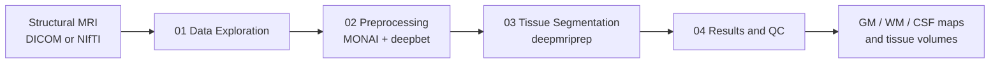

# brain-mri-segmentation-pipeline

Automated 3D brain tissue segmentation on structural MRI using **pretrained deep learning models** in Python, PyTorch, MONAI, `deepbet`, and `deepmriprep`.

This repository is a portfolio version of the project. It shows how AI is used for skull stripping, tissue segmentation, and optional fine-grained brain parcellation, while the rest of the pipeline focuses on reproducible preprocessing, inference, and quality control. The public repo includes the code, notebooks, and workflow, while excluding raw scans, processed medical volumes, segmentation files, and scan-derived figures.

**Important:** this repository is for engineering and educational purposes only. It is not a diagnostic tool and must not be used for medical decision-making.

## Project Goal

Build a reproducible end-to-end workflow that:

1. Loads and quality-checks a 3D brain MRI.
2. Reorients and resamples the scan into a model-friendly format.
3. Removes non-brain tissue with a pretrained skull-stripping model.
4. Segments the brain into gray matter, white matter, and cerebrospinal fluid.
5. Produces quality-control figures and quantitative tissue-volume outputs.

## How AI Is Used

AI in this project is used through **pretrained 3D medical imaging models**. The repository does not train a model from scratch. Instead, it applies existing deep learning models to a structural brain MRI and wraps them in a reproducible preprocessing and QC pipeline.

The main AI components are:

- **Skull stripping with `deepbet`:** a pretrained deep learning model removes skull, scalp, and other non-brain tissue so later segmentation focuses on brain voxels only.
- **Tissue segmentation with `deepmriprep`:** a pretrained model predicts voxelwise gray matter, white matter, and cerebrospinal fluid probability maps, then converts them into a final 3-class label map.
- **Optional advanced parcellation with MONAI:** the `03b_advanced_parcellation.ipynb` notebook uses MONAI's pretrained `wholeBrainSeg_Large_UNEST_segmentation` bundle to label 100+ anatomical structures such as the hippocampus, amygdala, and thalamus.

Everything around those models is standard engineering rather than AI model development:

- loading NIfTI data with `nibabel` and MONAI
- reorienting and resampling volumes
- normalizing intensities
- saving NIfTI outputs
- generating overlays, QC figures, and tissue-volume summaries

## Public Repo Scope

This public repository includes:

- notebook-based pipeline code
- dependency definitions
- documentation
- folder structure for local data and outputs

This public repository does **not** include:

- DICOM source files
- NIfTI scans
- derived brain volumes
- segmentation outputs

## Pipeline



The core workflow is split into four notebooks:

1. `notebooks/01_data_exploration.ipynb`
2. `notebooks/02_preprocessing.ipynb`
3. `notebooks/03_tissue_segmentation.ipynb`
4. `notebooks/04_results_and_qc.ipynb`

Optional advanced-analysis notebooks extend the core pipeline:

5. `notebooks/03b_advanced_parcellation.ipynb`
6. `notebooks/03c_regional_volumes.ipynb`

## Local Outputs

When you run the pipeline locally, it generates:

- figures in `outputs/figures/`
- segmentation volumes in `outputs/segmentations/`
- processed intermediate NIfTI files in `data/processed/`

These artifacts are intentionally excluded from the public repository.

## Expected Outputs

When you run the pipeline locally on your own de-identified MRI, the main outputs are:

- `outputs/segmentations/gm_probability.nii.gz`
- `outputs/segmentations/wm_probability.nii.gz`
- `outputs/segmentations/csf_probability.nii.gz`
- `outputs/segmentations/tissue_segmentation_3class.nii.gz`
- `outputs/segmentations/tissue_volumes.csv`

The 3-class segmentation uses:

- `1 = Gray Matter (GM)`
- `2 = White Matter (WM)`
- `3 = Cerebrospinal Fluid (CSF)`

## Quick Start

```bash
pip install -r requirements.txt
jupyter lab
```

Run the core notebooks in order from `01` to `04`.

If you want the advanced 133-label analysis, run:

1. `03b_advanced_parcellation.ipynb`
2. `03c_regional_volumes.ipynb`

after notebook `02` has completed and the skull-stripped brain is available.

If you are starting from an MRI volume, place your local input at:

```text
data/raw/brain_scan.nii.gz
```

Generated artifacts will be written to:

```text
data/processed/
outputs/figures/
outputs/segmentations/
```

## Repository Structure

```text
brain-mri-segmentation-pipeline/
├── DICOM/                  # local-only, gitignored
├── data/
│   ├── raw/                # local-only, gitignored
│   └── processed/          # local-only, gitignored
├── models/                 # local-only, gitignored
├── notebooks/
│   ├── 01_data_exploration.ipynb
│   ├── 02_preprocessing.ipynb
│   ├── 03_tissue_segmentation.ipynb
│   ├── 03b_advanced_parcellation.ipynb
│   ├── 03c_regional_volumes.ipynb
│   └── 04_results_and_qc.ipynb
├── outputs/
│   ├── figures/            # local-only, gitignored
│   └── segmentations/      # local-only, gitignored
├── src/
│   └── regional_volumes.py
├── .gitignore
└── requirements.txt
```

## Tech Stack

- Python
- Jupyter Notebooks
- nibabel
- PyTorch
- MONAI
- matplotlib
- deepbet
- deepmriprep

## Privacy Notes

- This public repo excludes raw source data, volumetric derivatives, and scan-derived figures.
- Only run the pipeline on scans you are entitled to process and share.
- If you plan to publish outputs, use a fully de-identified public dataset or explicit patient-approved data handling.

## Next Improvements

- convert notebook logic into reusable modules under `src/`
- add CLI entry points for preprocessing and segmentation
- add tests around file validation and path handling
- document how to run the pipeline on a public demo dataset
